# 🛡️ MISP Threat Intelligence Platform — Deployment & Event Management Lab

A hands-on lab documenting the deployment, configuration, and operational use of **MISP (Malware Information Sharing Platform)** — an open-source threat intelligence and sharing platform used by SOC teams, CERTs, and threat intel analysts worldwide.

This repository captures a complete workflow: from initial platform setup on **Kali Linux**, through organisation configuration, to creating and enriching a real-world threat intelligence event based on a **Bumblebee → AdaptixC2 → Akira ransomware** infection chain.

---

## 📌 Overview

MISP (`misp-project.org`) is used by security teams to **share, store, and correlate** Indicators of Compromise (IOCs), threat actor TTPs, and structured threat data using formats like STIX, OpenIOC, and CSV. This lab was built to develop practical, operator-level familiarity with MISP — a core skill for threat detection, incident response, and CTI (Cyber Threat Intelligence) work.

**Environment:** Kali Linux | MISP v2.5.44 | Self-hosted (localhost)

---

## 🎯 What This Lab Covers

- ✅ Standing up a local MISP instance and reviewing the platform architecture
- ✅ Creating a custom organisation profile (`MGSystems`) with contact metadata
- ✅ Understanding MISP's default `ADMIN` organisation and user administration
- ✅ Reviewing MISP's scheduled task automation (feed fetch/cache, taxonomy & galaxy updates)
- ✅ Creating a threat intelligence **Event** from an open-source research report
- ✅ Adding structured **Attributes** (e.g., MD5 hash IOCs) under the *External analysis* category
- ✅ Enabling IDS export and correlation flags on attributes
- ✅ Configuring and reviewing **Threat Intel Feeds** (CIRCL OSINT, Botvrij.eu)
- ✅ Understanding MISP's event lifecycle: draft → warnings → attributes → publish

---

## 🖼️ Walkthrough

### 1. Platform Overview
The MISP project homepage — an open-source threat intelligence sharing platform supporting XML/JSON, OpenIOC, STIX, Suricata/Snort exports, and CSV import/export.


### 2. Login & Initial Access
Authenticating into the self-hosted MISP instance.

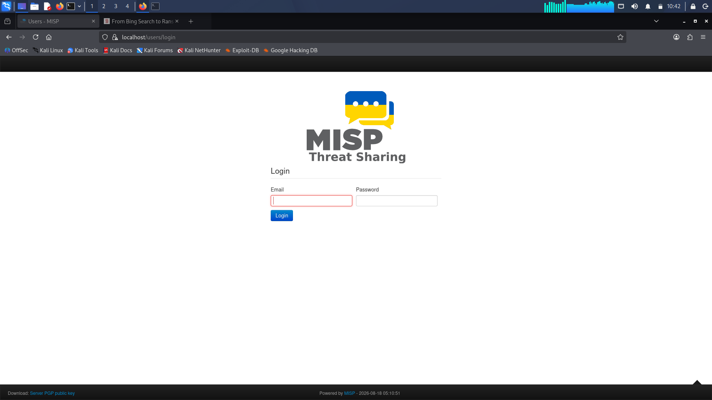

### 3. Events Dashboard
The default **Events** index — the primary workspace for creating, filtering, and managing threat intelligence events.

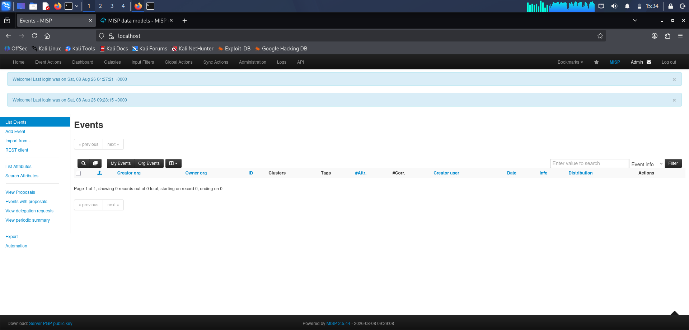

### 4. Organisation Setup — `MGSystems`
Registering a new local organisation with UUID, sector, nationality, and contact details.

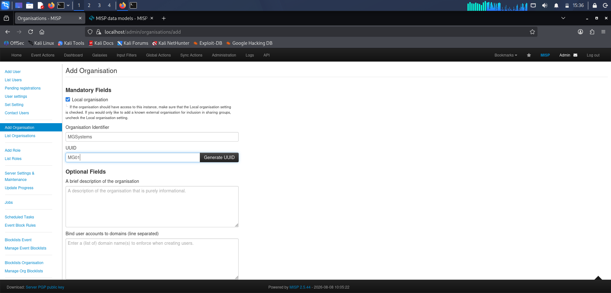
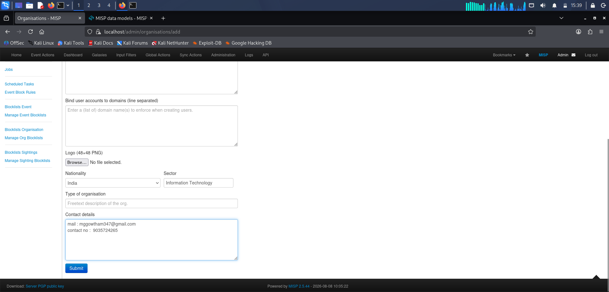
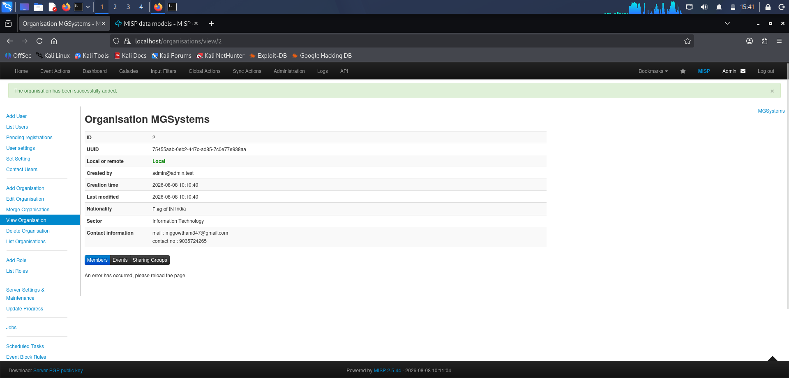

### 5. Default Admin Organisation
Reviewing the auto-generated `ADMIN` organisation and its associated user index.

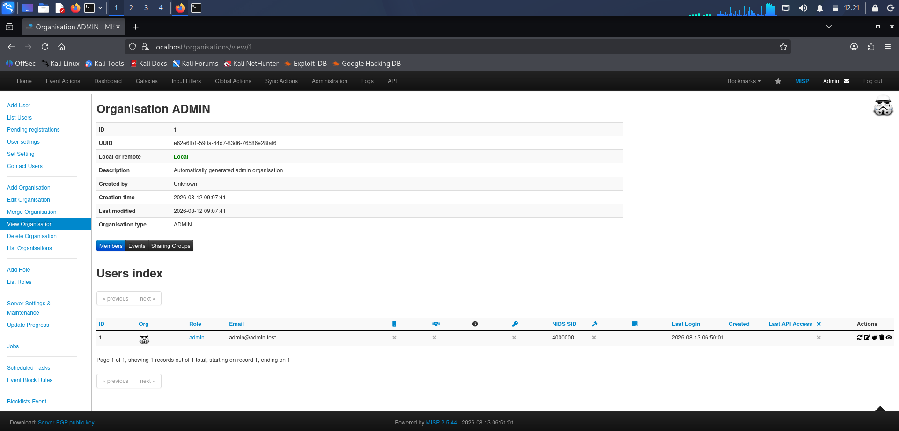

### 6. Scheduled Tasks & Automation
MISP's built-in job scheduler — automating daily feed fetches, server pull/push syncs, and taxonomy/galaxy/object template updates.

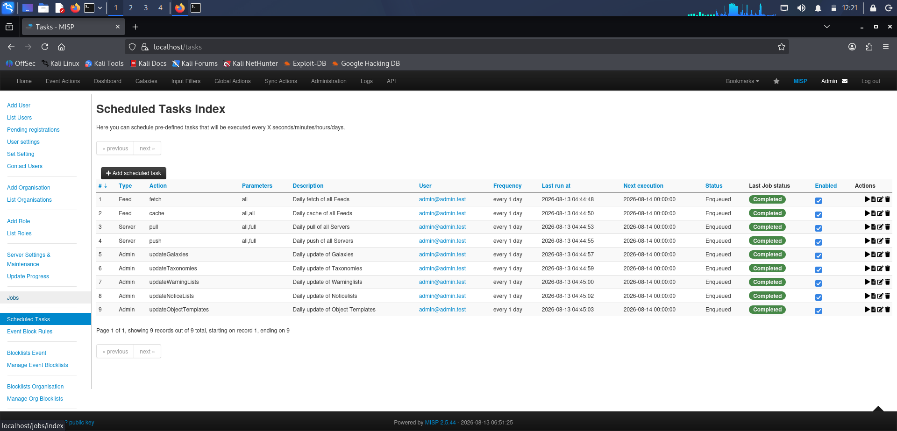

### 7. Creating a Threat Intelligence Event
Building a new event from an open-source report: **"From Bing Search to Ransomware: Bumblebee and AdaptixC2 Deliver Akira"** — set with `High` threat level and `Completed` analysis status.

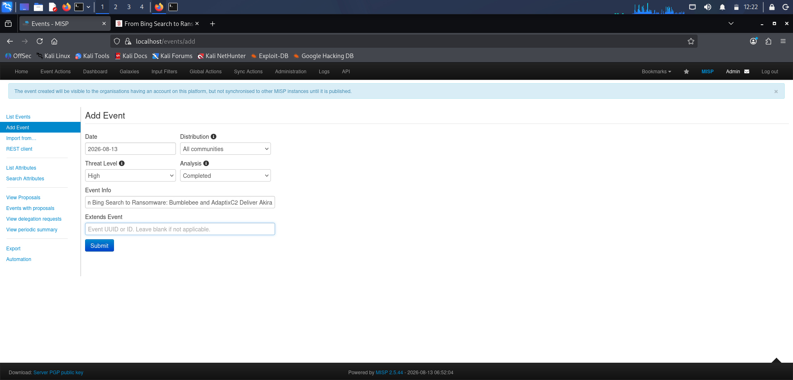
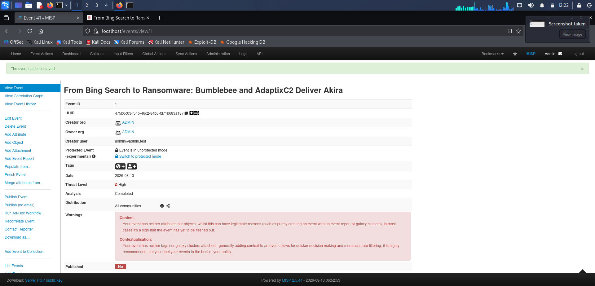

### 8. Event Warnings & Data Quality Checks
MISP flags events with no attributes/objects or missing tags — reinforcing the platform's emphasis on contextualised, high-fidelity intel.

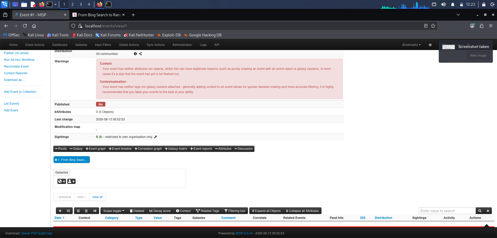
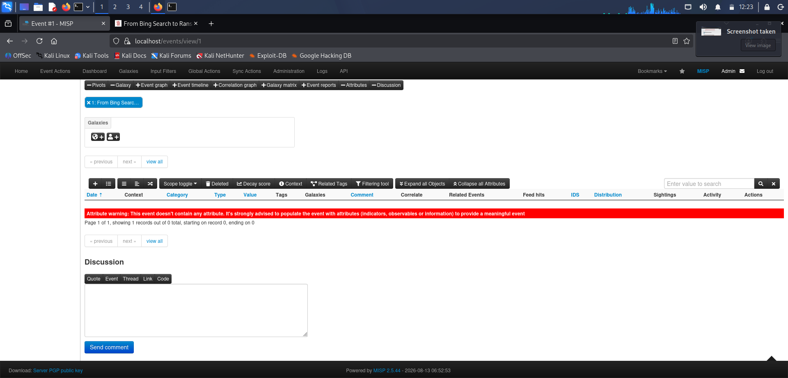

### 9. Adding IOC Attributes
Enriching the event with a malware **MD5 hash** under the *External analysis* category, with IDS export and Batch Import enabled.

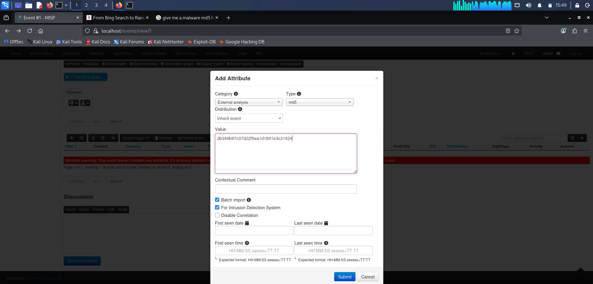
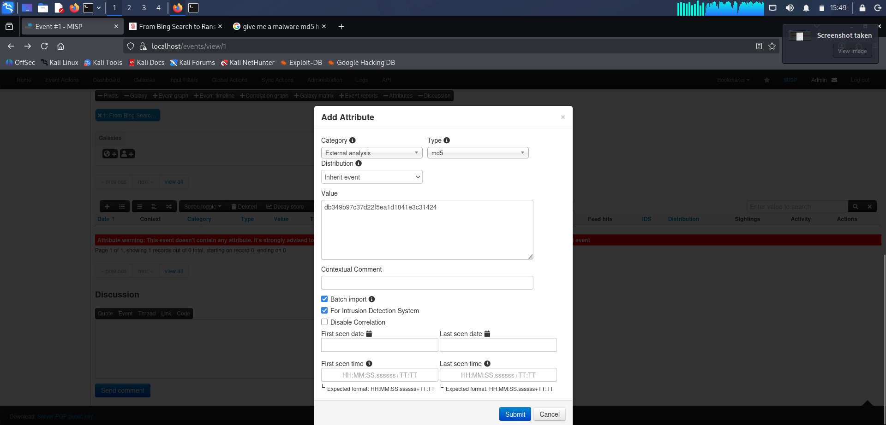
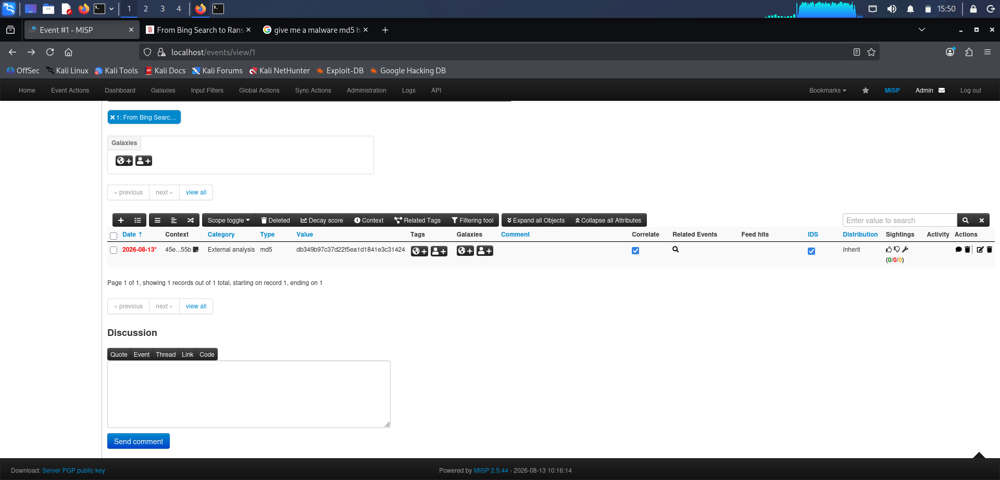

### 10. Threat Intel Feed Configuration
Reviewing configured OSINT feeds — **CIRCL OSINT Feed** and **Botvrij.eu Data** — used for automated IOC ingestion and correlation.

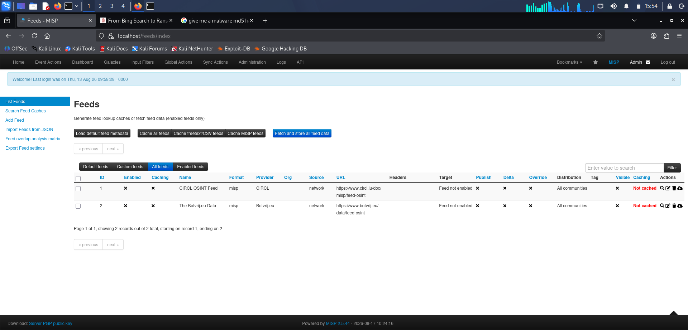

---

## 🧰 Tech Stack

| Component | Details |
|---|---|
| **Platform** | MISP v2.5.44 |
| **Host OS** | Kali Linux |
| **Data Formats** | STIX, OpenIOC, MISP XML/JSON, CSV |
| **Feeds Used** | CIRCL OSINT Feed, Botvrij.eu |
| **Threat Sample Reference** | Bumblebee Loader → AdaptixC2 → Akira Ransomware |

---

## 🚀 Key Takeaways

- Understanding **event-driven** threat intel modeling (Event → Attributes → Objects → Tags/Galaxies)
- Practical exposure to **IOC lifecycle management** — creation, correlation, IDS flagging, and distribution scoping
- Hands-on experience with **organisation and access administration** in a multi-tenant CTI platform
- Familiarity with **automated feed ingestion** for continuous threat intelligence enrichment

---

## 📂 Repository Structure

```
├── README.md
├── Screenshot_2026-08-08_10_02_16.jpg
├── Screenshot_2026-08-08_15_34_30.png
├── Screenshot_2026-08-08_15_36_04.png
├── Screenshot_2026-08-08_15_39_23.png
├── Screenshot_2026-08-08_15_41_12.png
├── Screenshot_2026-08-13_12_21_15.png
├── Screenshot_2026-08-13_12_21_34.png
├── Screenshot_2026-08-13_12_22_51.png
├── Screenshot_2026-08-13_12_23_00.png
├── Screenshot_2026-08-13_12_23_06.png
├── Screenshot_2026-08-13_12_23_12.png
├── Screenshot_2026-08-13_15_49_52.png
├── Screenshot_2026-08-13_15_49_57.png
├── Screenshot_2026-08-13_15_50_16.png
├── Screenshot_2026-08-17_15_54_56.png
└── Screenshot_2026-08-18_10_42_05.png
```

> ⚠️ Upload these screenshots to the **root** of your GitHub repo (same level as `README.md`) so the image links above resolve correctly.

---

## 🔗 References

- [MISP Project — Official Site](https://www.misp-project.org/)
- [MISP GitHub Repository](https://github.com/MISP/MISP)
- [MISP Documentation](https://www.misp-project.org/documentation/)

---

## 👤 Author

**Gowtham MG**
Assistant Professor, Dept. of MCA | Cybersecurity & Threat Detection Enthusiast
🔗 GitHub: [@GOWTHAMMG347](https://github.com/GOWTHAMMG347)

---

⭐ If you found this lab useful for learning MISP, consider starring the repo!
